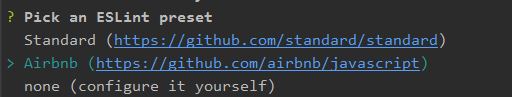

# vue 项目规范

## 结构化规范（webpack）

```
   ├── index.html                      入口页面
   ├── favicon.ico                     页面图标
   ├── .babelrc                        babel规则
   ├── .editorconfig                   编辑器配置
   ├── .eslintignore                   eslint忽略规律
   ├── .eslintrc.js                    eslint规则
   ├── .gitignore                      git忽略规则
   ├── build                           构建脚本目录
   │   ├── build-server.js                 运行本地构建服务器，可以访问构后的页面
   │   ├── build.js                        生产环境构建脚本
   │   ├── dev-client.js                   开发服务器热重载脚本，主要用来实现开发阶段的页面自动刷新
   │   ├── dev-server.js                   运行本地开发服务器
   │   ├── utils.js                        构建相关工具方法
   │   ├── webpack.base.conf.js            wabpack基础配置
   │   ├── webpack.dev.conf.js             wabpack开发环境配置
   │   └── webpack.prod.conf.js            wabpack生产环境配置
   │   └── webpack.cdn.conf.js             wabpack cdn配置
   │   └── webpack.dll.conf.js             wabpack dll配置
   ├── config                          项目配置
   │   ├── dev.env.js                      开发环境变量
   │   ├── index.js                        项目配置文件
   │   ├── prod.env.js                     生产环境变量
   │   └── test.env.js                     测试环境变量
   ├── mock                            mock数据目录
   │   └── hello.js
   ├── package.json                    npm包配置文件，里面定义了项目的npm脚本，依赖包等信息
   ├── readmd.md                       项目描述文件
   ├── src                                项目源码目录
   │   ├── main.js                            入口js文件
   │   ├── App.vue                            根组件
   │   ├── components                         公共组件目录
   │   │   └── title.vue
   │   ├── assets                         静态资源目录，这里的资源会被wabpack构建
   │   │   ├── css                            公共样式文件目录
   │   │   ├── js                             公共js文件目录（如帮助方法）
   │   │   └── img                            图片存放目录
   |   |── lib                            外部引用的插件存放及修改文件
   |   |—— datas                          模拟数据，临时存放
   │   ├── routes                         前端路由
   │   │   └── index.js
   │   ├── api                            接口，统一管理
   │   │   └── index.js
   │   ├── store                          vuex, 统一管理
   │   │   └── index.js
   │   └── views                          视图模块名
   │       ├── hello.vue
   │       └── notfound.vue
   ├── static                             纯静态资源，不会被wabpack构建。
   └── test                               测试文件目录（unit&e2e）
       └── unit                               单元测试
           ├── index.js                           入口脚本
           ├── karma.conf.js                      karma配置文件
           └── specs                           单测case目录
               └── Hello.spec.js
```

## vue 文件

- 基本结构
  ```html
  <template>
    <div></div>
  </template>
  <script>
    export default {
      components: {},
      data() {
        return {};
      },
      methods: {},
      mounted() {}
    };
  </script>
  <!-- 声明语言，并且添加scoped -->
  <style lang="less" scoped></style>
  ```

* vue 文件方法声明顺序

      - components
      - props
      - data
      - computed
      - created
      - mounted
      - activited
      - update
      - beforeRouteUpdate
      - metods
      - watch

## 标签属性自动换行

对除第一个属性外的其他每个属性进行换行，并保持对齐

```Html
<!-- 推荐 -->
<a :href="item.onestore_url"
   target="_blank"
   @click="goToDownload()">
  
</a>

```

```Html

<!-- 不推荐 -->
<a :href="item.onestore_url" target="_blank" @click="goToDownload()">
  
</a>

```

## 组件命名规范

- 组件名应该始终是多个单词的，根组件 App 除外
- 有意义的名词、简短、具有可读性
- 命名遵循 PascalCase(单词首字母大写命名) 约定

  - 公用组件以 Abcd (公司名缩写简称) 开头，如（AbcdDatePicker,AbcdTable）
  - 页面内部组件以组件模块名简写为开头，Item 为结尾，如（StaffBenchToChargeItem，StaffBenchAppNotArrItem）

- 使用遵循 kebab-case(短横线分隔命名) 约定

- 在页面中使用组件需要前后闭合，并以短线分隔，如（`<abcd-date-picker></abcd-date-picker>`，`<abcd-table></abcd-table>`）

- 导入及注册组件时，遵循 PascalCase(单词首字母大写命名) 约定

- 同时还需要注意：必须符合自定义元素规范: 切勿使用保留字。

## props 命名规范

在声明 prop 的时候，其命名应该始终使用 camelCase，而在模板中应该始终使用 `kebab-case`

```html
<!-- 推荐 -->
<script>
  props: {
    greetingText: String;
  }
</script>

<welcome-message greeting-text="hi"></welcome-message>

<!-- 不推荐 -->
<script>
  props: {
    'greeting-text': String
  }
</script>

<welcome-message greetingText="hi"></welcome-message>
```

## 注释规范

代码注释在一个项目的后期维护中显的尤为重要，所以我们要为每一个被复用的组件编写组件使用说明，为组件中每一个方法编写方法说明。

以下情况，务必添加注释

    1.公共组件使用说明
    2.各组件中重要函数或者类说明
    3.复杂的业务逻辑处理说明
    4.特殊情况的代码处理说明,对于代码中特殊用途的变量、存在临界值、函数中使用的hack、使用了某种算法或思路等需要进行注释描述
    5.注释块必须以/**（至少两个星号）开头**/；
    6.单行注释使用//；
    7.多重 if 判断语句

## 编码规范

### 使用 ES6 风格编码源码

- 定义变量使用 `let` ,定义常量使用 `const`

- 静态字符串一律使用单引号或反引号，动态字符串使用反引号

  ```javascript
  // 推荐
  const a = 'foobar';
  const b = `foo${a}bar`;
  const c = 'foobar';

  // 不推荐
  const a = 'foobar';
  const b = 'foo' + a + 'bar';
  ```

- 解构赋值

  ```javascript
  // 数组解构赋值
  const arr = [1, 2, 3, 4];
  // 推荐
  const [first, second] = arr;
  // 不推荐
  const first = arr[0];
  const second = arr[1];

  // 对象解构赋值
  // 推荐
  function getFullName(obj) {
    const { firstName, lastName } = obj;
  }
  // best
  function getFullName({ firstName, lastName }) {}
  // 不推荐
  function getFullName(user) {
    const firstName = user.firstName;
    const lastName = user.lastName;
  }
  ```

- 拷贝数组

  使用扩展运算符（...）拷贝数组。

  ```javascript
  const items = [1, 2, 3, 4, 5];
  // 推荐
  const itemsCopy = [...items];
  // 不推荐
  const itemsCopy = items;
  ```

- 箭头函数

  需要使用函数表达式的场合，尽量用箭头函数代替。因为这样更简洁，而且绑定了 `this`

  ```javascript
  // 推荐
  const boundMethod = (...params) => method.apply(this, params);
  // 不推荐
  const self = this;
  const boundMethod = function(...params) {
    return method.apply(self, params);
  };
  ```

- 模块

  - 如果模块只有一个输出值，就使用 export default，如果模块有多个输出值，就不使用 export default，export default 与普通的 export 不要同时使用

    ```javascript
    // 推荐
    import myObject from './importModule';

    // 不推荐
    import * as myObject from './importModule';
    ```

  - 如果模块默认输出一个函数，函数名的首字母应该小写

    ```javascript
    function makeStyleGuide() {}

    export default makeStyleGuide;
    ```

  - 如果模块默认输出一个对象，对象名的首字母应该大写

    ```javascript
    const StyleGuide = {
      es6: {}
    };

    export default StyleGuide;
    ```

### 指令规范

- 指令有缩写一律采用缩写形式

  ```javascript
  // 推荐
  :class="{'show-left'：true}"
  @click="getListData"

  // 不推荐
  v-bind:class="{'show-left'：true}"
  v-on:click="getListData"
  ```

- v-for 循环必须加上 key 属性，在整个 for 循环中 key 需要唯一

  ```html
  <!-- 推荐 -->
  <ul>
    <li v-for="todo in todos" :key="todo.id">
      {{ todo.text }}
    </li>
  </ul>

  <!-- 不推荐 -->
  <ul>
    <li v-for="todo in todos">
      {{ todo.text }}
    </li>
  </ul>
  ```

- 避免 v-if 和 v-for 同时用在一个元素上（性能问题）

### Props 规范

- 组件 props 原子化
- 提供默认值
- 使用 type 属性校验类型
- 使用 props 之前先检查该 prop 是否存在

```javascript
// bad 这样做只有开发原型系统时可以接受
props: ['status']

// good
props: {
  status: {
    type: String,
    required: true,
    validator: function (value) {
      return [
        'syncing',
        'synced',
        'version-conflict',
        'error'
      ].indexOf(value) !== -1
    }
  }
}

```

### 其他

- 避免 this.\$parent
- 调试信息 console.log() debugger 使用完及时删除
- 除了三目运算，if,else 等禁止简写

  ```javascript
  // bad
  if (true) alert(name);
  console.log(name);

  // good
  if (true) {
    alert(name);
  }
  console.log(name);
  ```

- 全局变量的位置

  如无特殊情况，变量`统一放到 data 内`，避免组件重用时代码不被执行

  ```javascript
  // 推荐
  export default {
    data() {
      return {
        today: new Date()
      };
    }
  };
  ```

  ```javascript
  // 不推荐
  const today = new Date();
  export default {
    data() {
      return {
        t: today
      };
    }
  };
  ```

## 开启 `ESLint`

- 统一用[`Airbnb`](https://github.com/airbnb/javascript)的代码规范

- 安装

  - 用 vue 脚手架初始化文件时，通过 vue-cli 的问答初始化 ESLint 的配置（推荐）

    

  - 直接引进 vue 模板的默认配置[`.eslintrc.js`](../source/vueEslint/.eslintrc.js)

    ```javascript
    // 1,安装依赖
    npm install babel-eslint eslint eslint-friendly-formatter eslint-loader eslint-config-airbnb-base eslint-import-resolver-webpack eslint-plugin-import eslint-plugin-vue

    // 2,在webpack.base.conf.js的rules里添加
    {
      test: /\.(js|vue)$/,
      loader: 'eslint-loader',
      enforce: 'pre',
      options: {
        formatter: require('eslint-friendly-formatter')
      }
    },
    ```

* 自动修复

  简单的代码风格 eslint 可以直接修复，比如我们希望 eslint 修复 src 文件夹下的 js 文件，那么在 package.json 中添加一条自定义命令

  ```bash
  # 安装eslint模块
  $ npm install eslint --save-dev
  ```

  ```
  # 添加eslint修复命令
  "lint-fix": "eslint --fix --ext .js src/"
  ```

  执行 `npm run lint-fix` 将自动修复。无法修复的将在控制台给出提示。

* git 预检查

  原则上每次`git commit`前我们都需要先执行一下 `lint-fix`命令的，避免遗忘或者偷懒，我们使用预检查工具进行处理。

  `husky` 是一个 npm 模块，可以在 git 提交前做拦截，如果拦截返回异常信息，将取消提交。

  安装`husky`

  ```bash
  $ npm install husky --save-dev
  ```

  添加拦截事件`precommit`

  ```
  # package.json
  "precommit": "npm run lint-fix"
  ```

  在提交前自动执行 eslint 修复命令，如果成功全部修复就可以正常提交，如果没有全部修复，将取消提交。

## 使用`Babel`

我们的 javascript 代码中经常会写 `ES6` 代码，而这些代码在旧版本浏览器上是不被识别的，需要转换成 `ES5`。

- 在项目根目录创建 `.babelrc` 文件

  ```javascript
  /* 根目录 .babelrc 文件 */
  {
    // 此项指明，转码的规则
    "presets": [
      // env项是借助插件babel-preset-env，下面这个配置说的是babel对es6,es7,es8进行转码，并且设置amd,commonjs这样的模块化文件，不进行转码
      ["env", {
        "modules": false,
        "targets": {
          "browsers": ["> 1%", "last 2 versions", "not ie <= 8"]
        }
      }],
      // 下面这个是不同阶段出现的es语法，包含不同的转码插件
      "stage-2"
    ],
    // 下面这个选项是引用插件来处理代码的转换，transform-runtime用来处理全局函数和优化babel编译
    "plugins": ["transform-vue-jsx", "transform-runtime"],
    // 下面指的是在生成的文件中，保留注释
    "comments": true,
    // 下面这段是在特定的环境中所执行的转码规则，当环境变量是下面的test就会覆盖上面的设置
    "env": {
      "test": {
        "presets": ["env", "stage-2"],
        "plugins": ["transform-vue-jsx", "istanbul"]
      }
    }
  }
  ```

- 使用 `babel-polyfill` 兼容 ES6

  1、安装

  ```bash
  $ npm install babel-polyfill --save-dev
  ```

  2、找到 `webpack.base.conf.js`(基础配置，全局生效) 文件，修改入口如下

  ```javascript
  module.exports = {
      entry: {
          app: ['babel-polyfill', './src/main.js'],
      },
  ```
