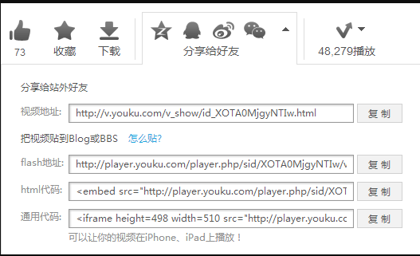
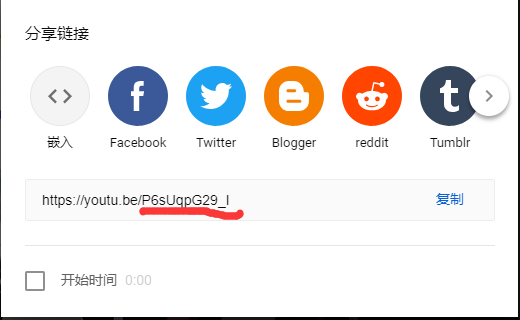

## 媒体文件规范

### 命名规范

命名全部用小写英文字母、数字、 - 的组合，其中不得包含汉字、空格、特殊字符；尽量用易懂的词汇, 便于团队其他成员理解; 另, 命名如果需要分头尾两部分, 用-隔开, 比如 ad-left01.gif、 btn-submit.gif、page-video.mp4;

### 引入规范

使用相对路径，不要指定资源所带的具体协议 ( http:,https: ) ，除非这两者协议都不可用。
推荐：

```Html

<video src="//reshw.ijunhai.com/public/img/video.mp4" type="video/mp4"  muted autoplay="autoplay" loop="loop">
```

不推荐：

```Html

<video src="http://reshw.ijunhai.com/public/img/video.mp4" type="video/mp4"  muted autoplay="autoplay" loop="loop">
```

### 存储位置（CDN）

目前公司有国内静态文件和海外静态文件的两个存放位置

- 国内：存放域名 res.ijunhai.com
- 海外：存放域名 reshw.ijunhai.com
- 如需要上传静态文件，请联系相关人员上传

## 图片规范

### 图片格式

常见的图片格式有 GIF、PNG、JPEG、WebP、svg，根据图片格式的特性和场景需要选取适合的图片格式。

#### 颜色较为丰富，文件体积较大的图片

- 优先考虑 JPEG 格式
- 条件允许的话优先考虑 WebP 格式
- 尽量不使用 PNG 格式，PNG8 色位太低，PNG24 压缩率低，文件体积大

#### 颜色比较简单、文件体积不大、起修饰作用的图片

- PNG 与 GIF 格式，优先考虑使用 PNG 格式，PNG 格式允许更多的颜色并提供更好的压缩率
- 图像颜色比较简单的，如纯色块线条图标，优先考虑使用 PNG 格式，避免不使用 JPEG 格式
- 图像颜色丰富而且图片文件不太大的（40KB 以下）或有半透明效果的优先考虑 PNG 格式
- 需要良好的放缩体验，需要动态控制图片特效，兼容 IE8 以上的，优先考虑 svg

#### 小图标（icon）

- 优先使用 iconfont，在[网站](https://www.iconfont.cn/)上进行注册账号，并把账号反馈给 UI，UI 会把你加入项目中。
- 使用 CSS Sprites，对于一些多色图标和需要过渡动画需用到雪碧图，把图标整合到一张大的图片中，再利用 CSS 的背景定位来显示需要显示的图片部分。

### 图片大小

- PC 平台单张的图片的大小不应大于 200KB。
- 移动平台单张的图片的大小不应大于 100KB。

### 必须指定 alt 属性

```Html

```

## 视频规范

### 视频格式

支持 HTML5 视频播放的浏览器支持 3 种视频格式 MP4, OGG 和 WebM,但并非所有的浏览器都支持 3 种。

### 视频大小

不超过 5M，如果视频过大，加载时间大于 1s，需要在页面开始时加上 loading，防止页面出现时间过慢，影响用户体验

### video 标签设置自动播放

浏览器一般不会再用户不同意的情况下就播放出媒体声音，这是不允许的，所以有声音就不能自动播放，所以需要在添加 autoplay 属性后再加上 muted，静音播放。

推荐：

```Html
<video  controls="controls" muted autoplay="autoplay" loop="loop" >
  <source src="path-to-mp4.mp4" type="video/mp4" />
  <source src="path-to-webm.webm" type="video/webm" />
  <source src="path-to-ogv.ogv" type="video/ogg" />
  您的浏览器不支持 video 标签。
</video>
```

### 插入外部视频方法选择

#### 视频作为背景

使用 video 标签，并用在父集标签上设置铺满整个可视范围

#### 页面中嵌入视频（优先使用 iframe 标签）

- 上传到 cdn 上引用
- 可先在各大视频网站上上传视频后引用

国内优酷视频：

```Html
<iframe height=498 width=510 src="http://player.youku.com/embed/XOTA1OTA2NjAw" frameborder=0 allowfullscreen></iframe>
```



海外 YouTube 视频：

打开 Youtube 视频，点击视频下方的“分享”，取到 YouTubeID。



```Html
<!-- youtube视频播放后不出现推荐视频，配置参数rel=0，下列的PgHDnbWqFcc即为唯一id，每次只需替换掉该id即可 -->
<iframe id="player" frameborder="0" allowfullscreen="1" allow="encrypted-media" title="YouTube video player" src="https://www.youtube.com/embed/PgHDnbWqFcc?rel=0&enablejsapi=1&widgetid=1"></iframe>
```
