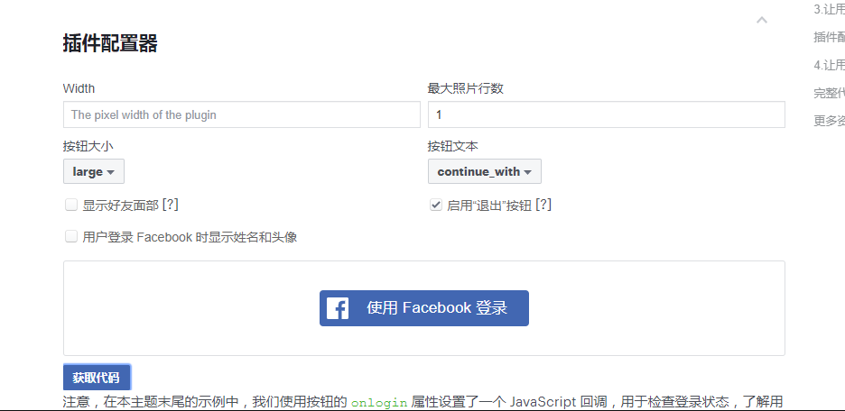
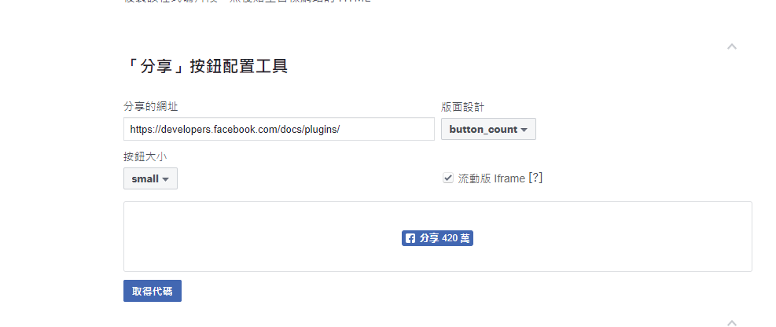
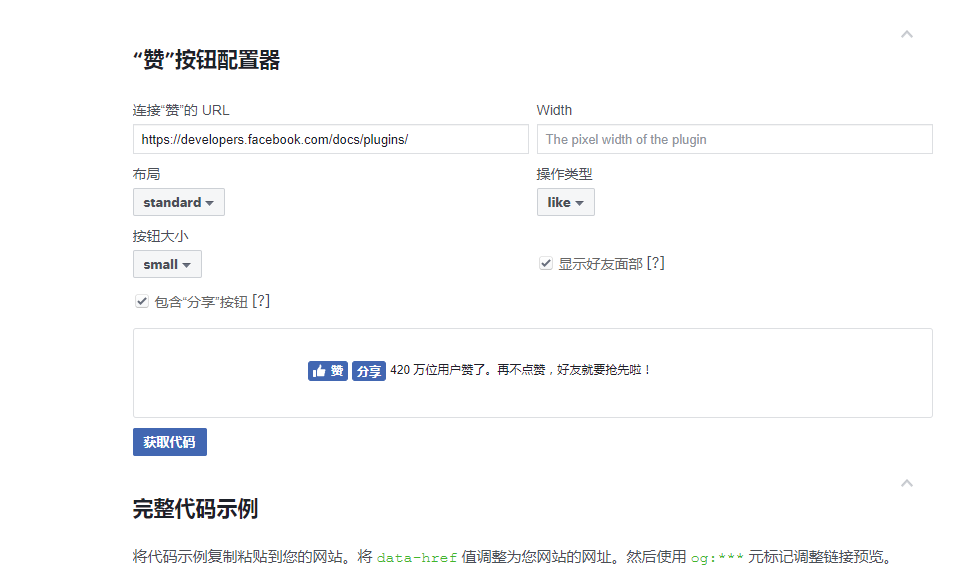
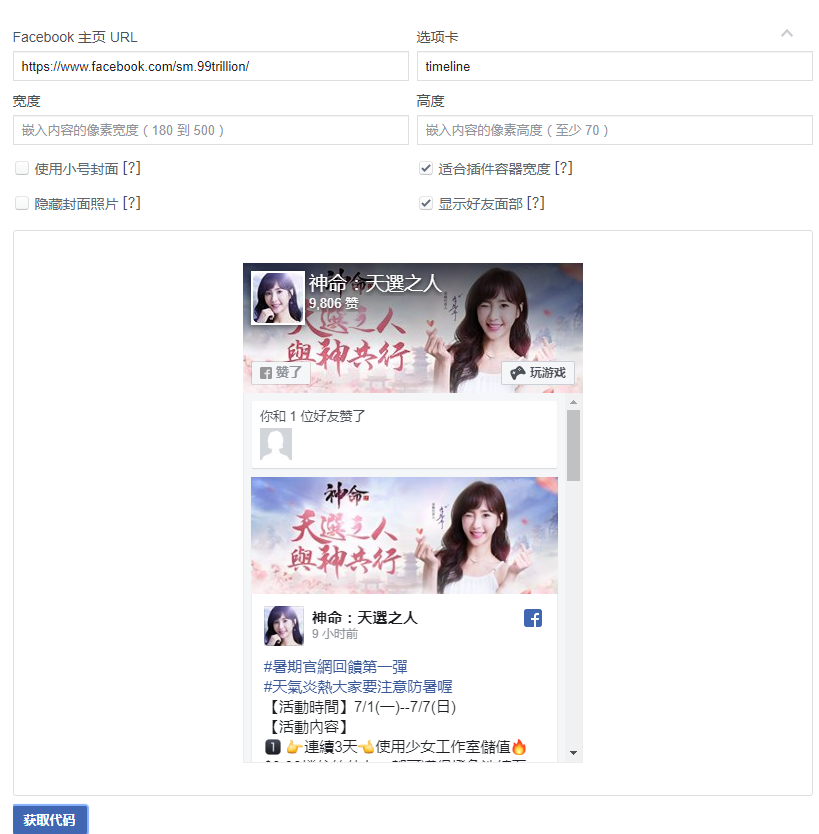

# Facebook 的一些基本操作（网页版）

利用 JavaScript SDK 进行 Facebook 的登录，点赞，分享和公共主页插件功能。

## 前期准备

1，注册一次 Facebook 账号，新建一个应用取到应用 id

2，引进 Facebook 的 SDK 到页面中：在 js 中引进以下代码，初始化

```javascript
// facebook
window.fbAsyncInit = function() {
  FB.init({
    appId: "your-app-id", //这里为你自己的应用id
    cookie: true,
    xfbml: true,
    version: "v2.8"
  });
};
(function(d, s, id) {
  let js,
    fjs = d.getElementsByTagName(s)[0];
  if (d.getElementById(id)) return;
  js = d.createElement(s);
  js.id = id;
  js.src = "//connect.facebook.net/en_US/sdk.js";
  fjs.parentNode.insertBefore(js, fjs);
})(document, "script", "facebook-jssdk");
```

## 登录

登录有两种方法，第一种使用 sdk 的方法登录，第二种则直接使用 Facebook 的自带插件，下面进行详细介绍

### 一，利用 JavaScript SDK 部署网页版“Facebook 登录”

1，在 html 页面中增加一个按钮点击

```html
<!DOCTYPE html>
<html lang="en">
  <head>
    <meta charset="UTF-8" />
    <title>Title</title>
    <script src="common.js"></script>
  </head>
  <body>
    <button onclick="login()">登录</button>
  </body>
</html>
```

2,在 js 中引进 login 函数（用 window.FB.getLoginStatus 函数判断登录状态）

```javascript
window.login = function() {
  window.FB.getLoginStatus(function(response) {
    if (response.status === "connected") {
      alert("您已经登录~");
    } else {
      window.FB.login();
    }
  });
};
```

### 二，利用插件配置器

1，进入[站点](https://developers.facebook.com/docs/facebook-login/web?locale=zh_CN)，在下面图片所示中进行配置，点击“获取代码”按钮。



2，在 HTML 页面中引进 js 代码（注意：如果你前面已经引进上述的 Facebook 的 SDK 到页面中，下面的 js 可以不用再次引用）

```html
<div id="fb-root"></div>
<script>
  (function(d, s, id) {
    var js,
      fjs = d.getElementsByTagName(s)[0];
    if (d.getElementById(id)) return;
    js = d.createElement(s);
    js.id = id;
    js.src =
      "https://connect.facebook.net/zh_CN/sdk.js#xfbml=1&version=v3.2&appId=your-app-id&autoLogAppEvents=1";
    fjs.parentNode.insertBefore(js, fjs);
  })(document, "script", "facebook-jssdk");
</script>

<div
  class="fb-login-button"
  data-max-rows="1"
  data-size="large"
  data-button-type="continue_with"
  data-show-faces="false"
  data-auto-logout-link="true"
  data-use-continue-as="false"
></div>
```

## 分享

分享也有有两种方法，第一种使用 sdk 的方法登录，第二种则直接使用 Facebook 的自带插件，下面进行详细介绍

### 一，利用 JavaScript SDK 部署网页版“Facebook 登录”

1，在 html 页面中加入分享按钮

```html
<!DOCTYPE html>
<html lang="en">
  <head>
    <meta charset="UTF-8" />
    <title>Title</title>
    <script src="common.js"></script>
  </head>
  <body>
    <button onclick="share()">分享</button>
  </body>
</html>
```

2，在 js 中引进 share 函数

```javascript
window.share = function() {
  window.FB.ui(
    {
      method: "share",
      href: "your-share-link"
    },
    function() {}
  );
};
```

下面介绍一些参数

1）href：分享的页面。需要注意的是在此网址的页面上必须添加开放图谱元标签，自定义分享的动态。
具体如下所示：在分享的 html 页面 head 里面加上以下代码

```html
<meta property="fb:app_id" content="your-app-id" />
<meta property="og:url" content="" />
<meta property="og:type" content="website" />
<!--分享的标题-->
<meta
  property="og:title"
  content="《神命：天選之人》--事情登錄得好康，分享抽mycard！"
/>
<!--分享的描述-->
<meta
  property="og:description"
  content="《神命：天選之人》強勢來襲！化形天神，舞動幹戚；神魔之戰，生死一念；神寵坐騎，飛天遁地；驚鴻一瞥，女神相隨！參與事前登錄，好康滿滿，更有機會贏Mycard！"
/>
<!--分享的图片-->
<meta
  property="og:image"
  content="http://www.99trillion.com/test20181214/share.ad3f2854.jpg"
/>
```

2）mobile_iframe：移动网页分享对话框也能够以 iFrame 窗口的形式显示在内容的顶部。完成分享操作流程后，该对话框将消失，而用户将回到之前所在的内容位置，以便轻松继续阅读内容。要让移动网页分享对话框显示在 iframe 窗口中，请将属性 mobile_iframe 设置为 true。

```javascript
window.share = function() {
  window.FB.ui(
    {
      method: "share",
      mobile_iframe: true,
      href: "your-share-link"
    },
    function() {}
  );
};
```

### 二，利用插件配置器

1，进入[站点](https://developers.facebook.com/docs/plugins/share-button#configurator)，在下面图片所示中进行配置，点击“获取代码”按钮。


2，在 HTML 页面中引进 js 代码（注意：如果你前面已经引进上述的 Facebook 的 SDK 到页面中，下面的 js 可以不用再次引用）
其中，href 为分享的页面

```html
<div id="fb-root"></div>
<script>
  (function(d, s, id) {
    var js,
      fjs = d.getElementsByTagName(s)[0];
    if (d.getElementById(id)) return;
    js = d.createElement(s);
    js.id = id;
    js.src =
      "https://connect.facebook.net/zh_CN/sdk.js#xfbml=1&version=v3.2&appId=your-app-id&autoLogAppEvents=1";
    fjs.parentNode.insertBefore(js, fjs);
  })(document, "script", "facebook-jssdk");
</script>

<div
  class="fb-share-button"
  data-href="https://developers.facebook.com/docs/plugins/"
  data-layout="button_count"
  data-size="small"
  data-mobile-iframe="true"
>
  <a
    target="_blank"
    href="https://www.facebook.com/sharer/sharer.php?u=https%3A%2F%2Fdevelopers.facebook.com%2Fdocs%2Fplugins%2F&amp;src=sdkpreparse"
    class="fb-xfbml-parse-ignore"
    >分享</a
  >
</div>
```

### 三，分享调试

进入[站点](https://developers.facebook.com/tools/debug/)，输入上面你分享的地址，可以刷新你更换的信息，如果分享不成功，也可以看到分享不成功的原因。

## 点赞

### 利用插件配置器

1，进入[站点](https://developers.facebook.com/docs/plugins/like-button)，在下面图片所示中进行配置，点击“获取代码”按钮。



2，在 HTML 页面中引进 js 代码（注意：如果你前面已经引进上述的 Facebook 的 SDK 到页面中，下面的 js 可以不用再次引用）
其中，data-href 为点赞的页面。

```html
<script>
  (function(d, s, id) {
    var js,
      fjs = d.getElementsByTagName(s)[0];
    if (d.getElementById(id)) return;
    js = d.createElement(s);
    js.id = id;
    js.src =
      "https://connect.facebook.net/zh_CN/sdk.js#xfbml=1&version=v3.2&appId=2145131702440053&autoLogAppEvents=1";
    fjs.parentNode.insertBefore(js, fjs);
  })(document, "script", "facebook-jssdk");
</script>

<div
  class="fb-like"
  data-href="https://developers.facebook.com/docs/plugins/"
  data-layout="standard"
  data-action="like"
  data-size="small"
  data-show-faces="true"
  data-share="true"
></div>
```

### 注意项

点赞功能需要在应用中进行申请，申请的条件有页面中需要登录按钮，并且该登录按钮可用。申请通过后，该点赞按钮才会在页面中显示。

## 公共主页插件

通过公共主页插件，您可以在网站上轻松嵌入和推广任何公开的 Facebook 主页。与在 Facebook 上一样，您的访客在网站中即可赞和分享主页。您可以将公共主页插件用于任何不受限制（例如国家/地区或年龄限制）的主页。

### 利用插件配置器

1、进入[站点](https://developers.facebook.com/docs/plugins/page-plugin/)，在下面图片所示中进行配置，点击“获取代码”按钮



2、在 HTML 页面中引进 js 代码（注意：如果你前面已经引进上述的 Facebook 的 SDK 到页面中，下面的 js 可以不用再次引用） 其中，data-href 为点赞的页面。

```html
<script>
  (function(d, s, id) {
    var js,
      fjs = d.getElementsByTagName(s)[0];
    if (d.getElementById(id)) return;
    js = d.createElement(s);
    js.id = id;
    js.src =
      "https://connect.facebook.net/zh_CN/sdk.js#xfbml=1&version=v3.2&appId=2145131702440053&autoLogAppEvents=1";
    fjs.parentNode.insertBefore(js, fjs);
  })(document, "script", "facebook-jssdk");
</script>

<div
  class="fb-page"
  id="fb-page"
  data-href="https://www.facebook.com/sm.99trillion/"
  data-tabs="timeline"
  data-width="366"
  data-height="490"
  data-small-header="true"
  data-adapt-container-width="true"
  data-hide-cover="false"
  data-show-facepile="false"
>
  <blockquote
    cite="https://www.facebook.com/sm.99trillion/"
    class="fb-xfbml-parse-ignore"
  >
    <a href="https://www.facebook.com/sm.99trillion/">Facebook</a>
  </blockquote>
</div>
```

### 注意项

- `blockquote`标签的内容用于分享页未加载出来时的显示
- 该插件有时无法渲染出来 iframe 的问题，该插件的 sdk 渲染 iframe 还需要去拿到对应 hash 的 sdk，加载流程为：在页面中必须先拿到 sdk1，执行 sdk1 去拿 sdk2，sdk2 中会触发 onload 函数再去渲染 ifram，如果页面加载速度快的时候，页面已经 load 完成，但是 sdk2 中的 onload 函数还未执行，会导致 iframe 渲染不了，
  解决方法有：页面加载完成之后自动刷新一次，刷新后加上时间戳，以识别为第二次加载
