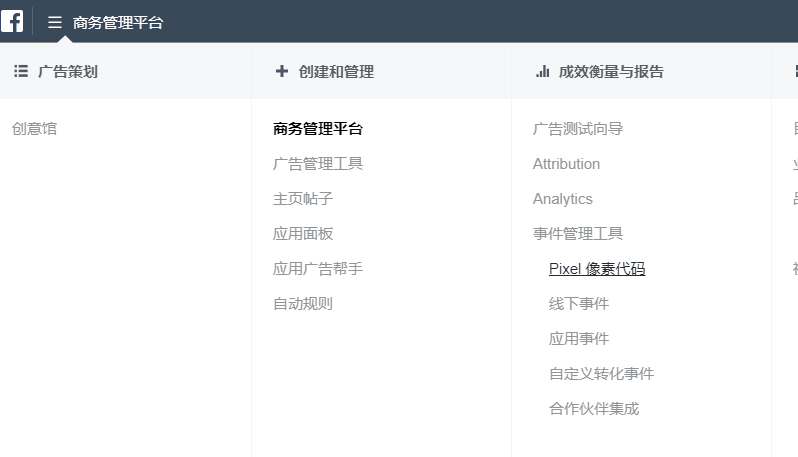
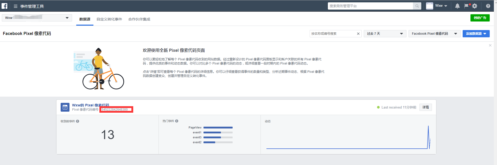
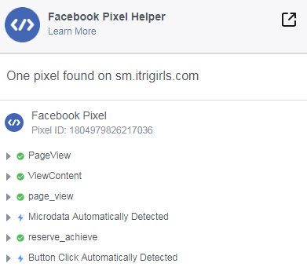
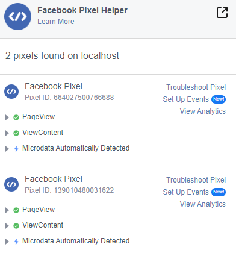
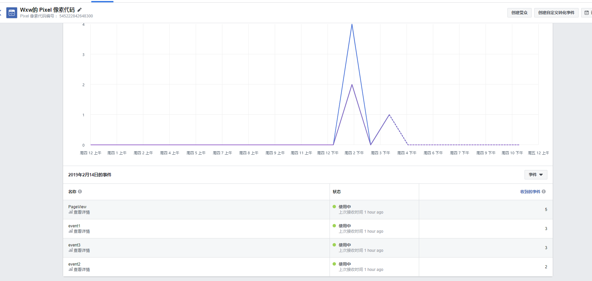

# Facebook Pixel 数据跟踪

## Facebook Pixel

Facebook 像素是一种分析工具，可帮助您了解用户在网站上采取的操作，继而衡量广告成效。利用像素收集的数据，您可以：

- 确保向合适受众展示广告

- 构建广告受众

- 使用其他 Facebook 广告工具

### 一，前期准备

在[商务管理平台](https://business.facebook.com/home/accounts)注册账号，然后在事件管理工具点击**Pixel 像素代码**，如下：



然后点击（添加数据源->Facebook Pixel 像素代码）,填写相应内容，便可以获得 Pixel 像素代码编号



### 二，安装 Pixel

#### 1，在网站中嵌入标头代码

```html
<script>
  !(function(f, b, e, v, n, t, s) {
    if (f.fbq) return;
    n = f.fbq = function() {
      n.callMethod ? n.callMethod.apply(n, arguments) : n.queue.push(arguments);
    };
    if (!f._fbq) f._fbq = n;
    n.push = n;
    n.loaded = !0;
    n.version = "2.0";
    n.queue = [];
    t = b.createElement(e);
    t.async = !0;
    t.src = v;
    s = b.getElementsByTagName(e)[0];
    s.parentNode.insertBefore(t, s);
  })(
    window,
    document,
    "script",
    "https://connect.facebook.net/en_US/fbevents.js"
  );
  fbq("init", "545222842648300");
  fbq("track", "PageView");
</script>
```

#### 2，在需要跟踪的事件中埋点

```html
<button onclick="event1()">event1</button>
<button onclick="event2()">event2</button>
<button onclick="event3()">event3</button>
<script>
  function event1() {
    window.fbq("trackCustom", "event1");
    alert("埋点event1");
  }
  function event2() {
    window.fbq("trackCustom", "event2");
    alert("埋点event2");
  }
  function event3() {
    window.fbq("trackCustom", "event3");
    alert("埋点event3");
  }
</script>
```

### 三，安装多个像素点 Pixel

#### 1，在网站中嵌入标头代码，注册多个像素 id

```html
<script>
  !(function(f, b, e, v, n, t, s) {
    if (f.fbq) return;
    n = f.fbq = function() {
      n.callMethod ? n.callMethod.apply(n, arguments) : n.queue.push(arguments);
    };
    if (!f._fbq) f._fbq = n;
    n.push = n;
    n.loaded = !0;
    n.version = "2.0";
    n.queue = [];
    t = b.createElement(e);
    t.async = !0;
    t.src = v;
    s = b.getElementsByTagName(e)[0];
    s.parentNode.insertBefore(t, s);
  })(
    window,
    document,
    "script",
    "https://connect.facebook.net/en_US/fbevents.js"
  );
  fbq("init", "<PIXEL_A>");
  fbq("init", "<PIXEL_B>");
  fbq("track", "PageView");
</script>
```

#### 2，在需要跟踪的事件中埋点

- 多个 id 跟踪同一个点

```html
<button onclick="event1()">event1</button>
<button onclick="event2()">event2</button>
<button onclick="event3()">event3</button>
<script>
  function event1() {
    window.fbq("trackCustom", "event1");
    alert("埋点event1");
  }
  function event2() {
    window.fbq("trackCustom", "event2");
    alert("埋点event2");
  }
  function event3() {
    window.fbq("trackCustom", "event3");
    alert("埋点event3");
  }
</script>
```

- 对跟踪的点进行不同的像素追踪

```html
<button onclick="event1()">event1</button>
<button onclick="event2()">event2</button>
<button onclick="event3()">event3</button>
<script>
  function event1() {
    window.fbq("trackSingleCustom", "<PIXEL_A>", "event1");
    alert("埋点event1");
  }
  function event2() {
    window.fbq("trackSingleCustom", "<PIXEL_B>", "event2");
    alert("埋点event2");
  }
  function event3() {
    window.fbq("trackSingleCustom", "<PIXEL_B>", "event3");
    alert("埋点event3");
  }
</script>
```

### 三，验证

#### 1，可以在谷歌的扩展程序上下载[Facebook Pixel Helper](https://chrome.google.com/webstore/detail/facebook-pixel-helper/fdgfkebogiimcoedlicjlajpkdmockpc)，可以观测数据变化

- 单个像素点
  

- 多个像素点
  

备注：网站必须在服务器上才能检测到

#### 2，可以在 Facebook Pixel 像素代码中查看数据

在[商务管理平台->事件管理工具->Facebook Pixel 像素代码](https://business.facebook.com/home/accounts)中，点击对应的数据源查看，如下：


