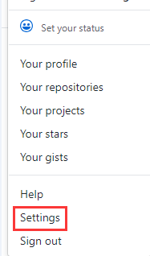
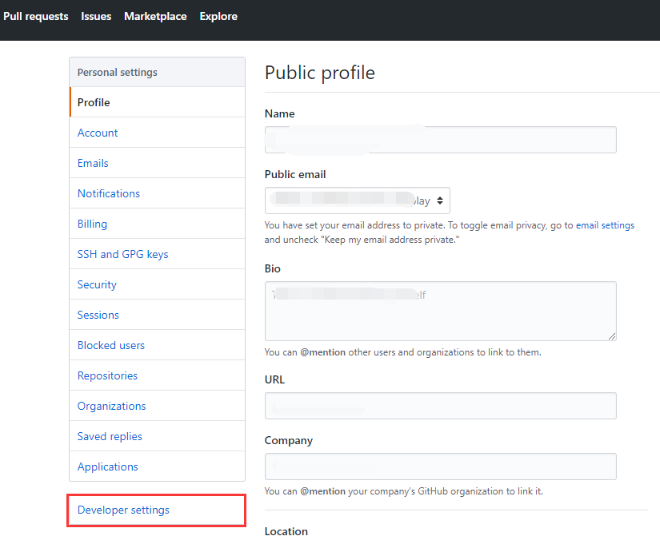
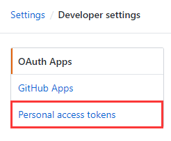
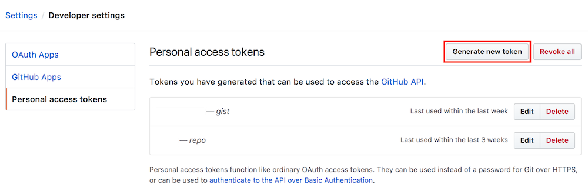
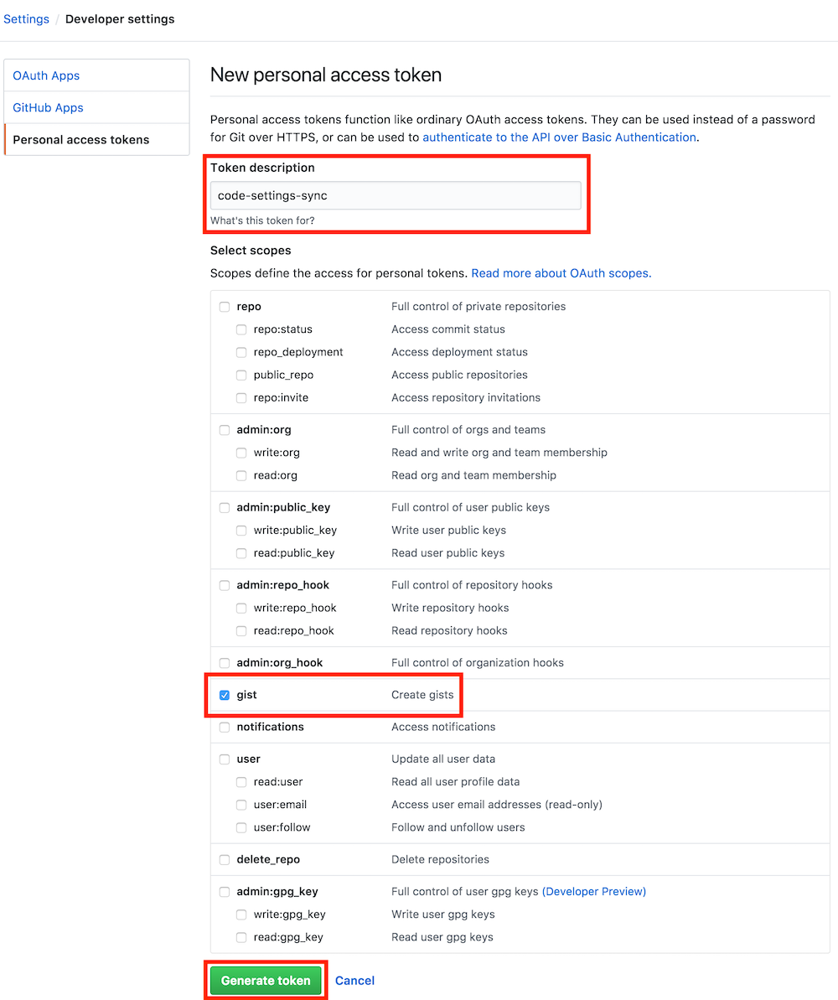
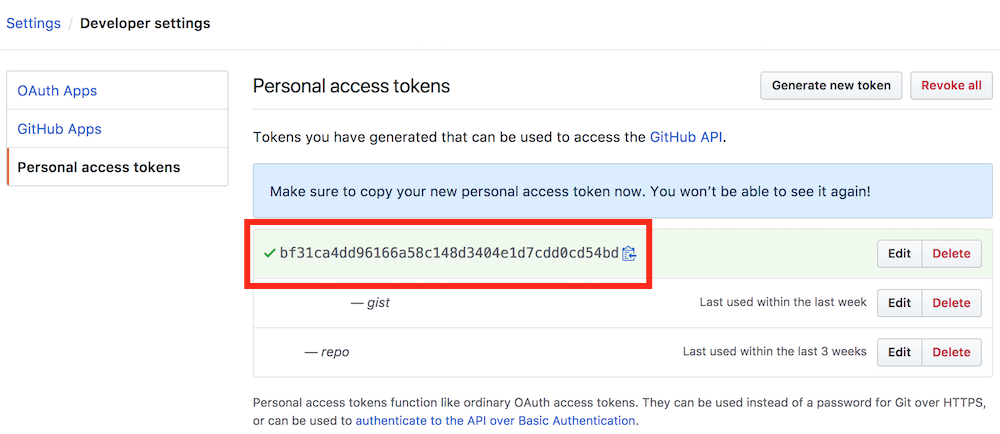
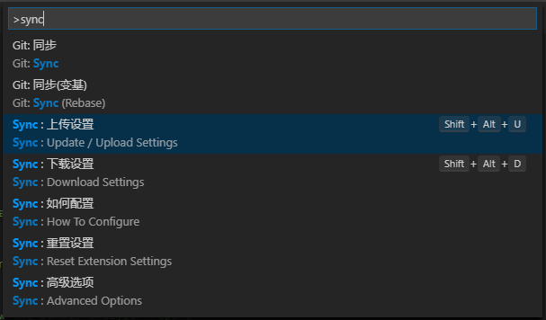
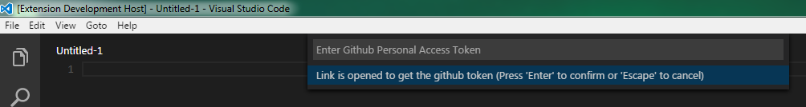
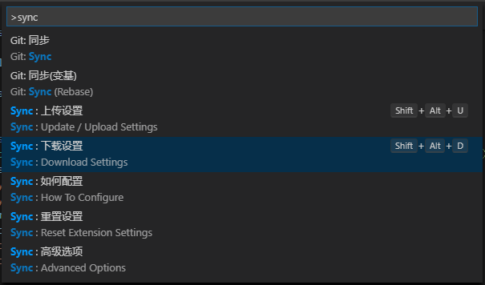

# vscode 配置规范

## 格式化配置

在 vscode 中打开 setting.json 文件，把下面的配置加上。

需安装以下插件：`eslint`(必须)、`vetur`(必须)、`prettier`(可选)、`liveServer`（可选）

```javascript
{
  // #编辑器设置
  "editor.detectIndentation": false,
  // 重新设定tabsize
  "editor.tabSize": 2,
  // 每次保存的时候自动格式化
  "editor.formatOnSave": true,
  // 粘贴自动格式化
  "editor.formatOnPaste": true,
  // 字体设置
  "editor.fontSize": 16,
  // #自动补全括号
  "editor.autoClosingBrackets": "always",
  "editor.quickSuggestions": {
    "other": true,
    "comments": true,
    "strings": true
  },
  "workbench.iconTheme": "vscode-great-icons",
  // 自动补全html标签,需先安装HTML Snippets插件
  "emmet.triggerExpansionOnTab": true,
  "emmet.includeLanguages": {
    "vue-html": "html",
    "vue": "html"
  },
  // #git配置
  "git.confirmSync": false,
  // git是否启用自动拉取
  "git.autofetch": true,
  // #eslint配置，需安装eslint插件
  "eslint.autoFixOnSave": true,
  "eslint.validate": [
    "javascript",
    "javascriptreact",
    {
      "language": "html",
      "autoFix": true
    },
    {
      "language": "vue",
      "autoFix": true
    }
  ],
  "explorer.confirmDelete": false,
  // #prettier配置，需安装prettier插件
  // 让prettier使用eslint的代码格式进行校验
  "prettier.eslintIntegration": true,
  // 使用带引号替代双引号
  "prettier.singleQuote": true,
  // 让函数(名)和后面的括号之间加个空格
  "javascript.format.insertSpaceBeforeFunctionParenthesis": true,
  // #vetur配置，需安装vetur插件
  "vetur.format.defaultFormatter.html": "js-beautify-html",
  // 让vue中的js按编辑器自带的ts格式进行格式化
  "vetur.format.defaultFormatter.js": "vscode-typescript",
  "vetur.format.defaultFormatterOptions": {
    "js-beautify-html": {
      "wrap_attributes": "force-aligned"
      // vue组件中html代码格式化样式
    }
  },
  // 默认浏览器设置
  "open-in-browser.default": "Chrome",
  // #liveServer配置，需安装liveServer插件，未安装则忽略
  "liveServer.settings.port": 3005, //设置本地服务的端口号
  "liveServer.settings.root": "/", //设置根目录，也就是打开的文件会在该目录下找
  "liveServer.settings.CustomBrowser": "chrome", //设置默认打开的浏览器
  "liveServer.settings.AdvanceCustomBrowserCmdLine": "chrome --incognito --remote-debugging-port=9222",
  "liveServer.settings.NoBrowser": false,
  "liveServer.settings.donotShowInfoMsg": true
}
```

## [补充]使用 Settings Sync 同步你的 vscode 配置

sync 插件的使用原理是通过 github 保存用户设置，然后在各个设备间同步拉取配置。

### 安装 Settings Sync

打开 vscode，在侧边栏拓展栏目中搜索`Settings Sync`，点击安装。

### 创建 github token

安装完拓展后，我们打开 github，创建一个新的令牌

```shell
1. 登录github
2. Settings / Developer settings
3. Personal access tokens
4. Generate new token
```

- 1.打开设置页面

  

- 2.打开开发者设置

  

- 3.打开个人 token

  

- 4.创建 token

  

- 5.创建时需要填写 token 描述和选中 gist，如图

  

- 6.创建完成后会得到一个 token

  

- 7.妥善保管该 token，以备将来使用（即从其他计算机上传）。

### 上传用户配置

- 回到 vscode，我们通过快捷键快速打开命令窗口 `ctrl + shift+ p`,输出`sync`关键字。

  

- 选择`Sync:上传设置`（快捷键：`shift + alt + u`）填写上一步获取到的 token 信息

  

- 回车后将上传用户配置（user setting 和拓展安装记录），第一次时间一般较长，上传完成后拓展会返回`Gist ID`，和前面 token 一样

- 妥善保管该 Gist ID，以备将来从其他机器下载最新设置。

### 下载用户配置

- 在其他电脑设备的编辑器上，下载用户设置，选择`Sync:下载设置`（快捷键：`shift + alt + d`）

  

- 回车后要求输入 token 和 gist id，按照提示输入即可。第一次拉取用户配置的时候，往往是比较慢的，因为要安装配置上的一些插件。
