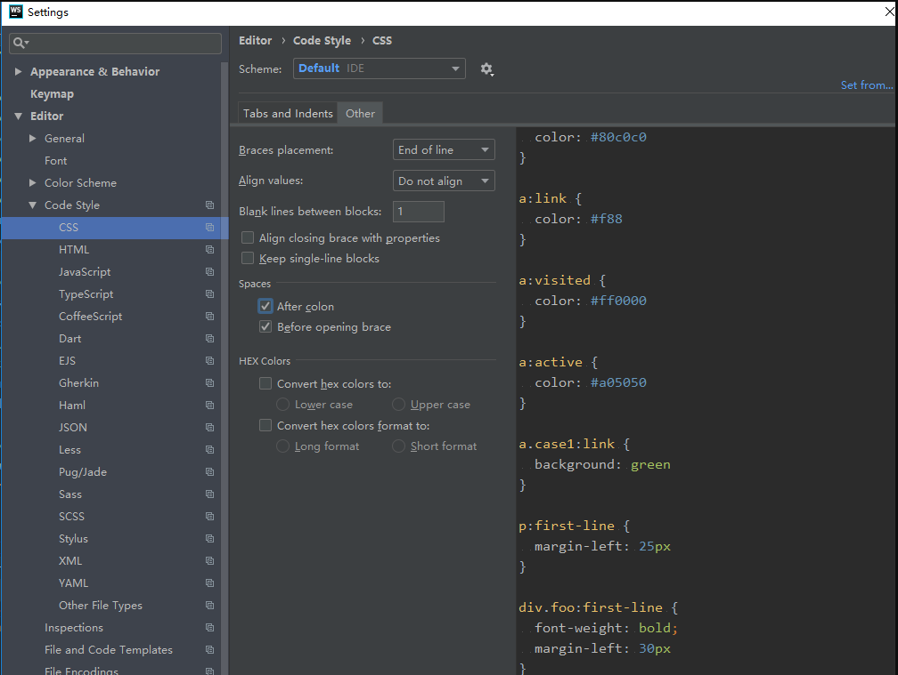

# webstorm 配置

## 格式化配置

### Javascript 配置

在 webstorm->file->settings->Editor->javascript 中

- 设置缩进为两格

  

- 设置单引号，末尾加分号

  

### HTML 配置

在 webstorm->file->settings->Editor->HTML 中

- 设置缩进为两格

  

- 其他设置

  

### CSS 配置

- 设置缩进为两格

  

- 其他设置

  

## eslint 配置

### 下载

在 webstorm->file->settings->plugins 中新增 eslint 插件

### 配置

在 webstorm->file->settings->Language & Frameworks -> Code Quality Tools ->ESLint 中进行配置，如下图

### 完成

在页面中点击鼠标右击会出现下图所示，点击 Fix ESlint Problems 即可自动进行 FIX

